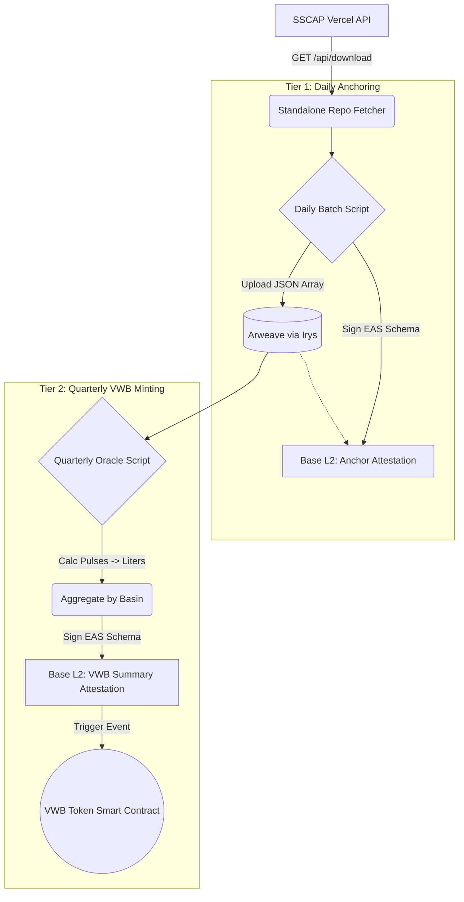

# VWB Token Blockchain Integration: System Architecture

This repository is designed to be a standalone, completely decoupled service that handles the blockchain integration (Base L2) and Volumetric Water Benefit (VWB) token minting for the SSCAP ecosystem.

## Core Principle
**Zero modifications are required on the existing Vercel Next.js SSCAP API.** 
This repository acts entirely downstream, treating the existing Vercel deployment as a read-only data source.

---

## 1. The Dual-Tier Architecture

To satisfy strict auditing requirements (every measurement must be verifiable) while enabling complex Tokenomics (VWB aggregating by basin/quarter), this repo implements a Dual-Tier model on Base L2.

### Tier 1: The "Auditable Anchor" (Daily)
- **Action**: Fetch raw data, batch it, freeze it on Arweave, and anchor it to Base.
- **Goal**: Produce an immutable, timestamped record of every sensor pulse and drop of rain without paying exorbitant Ethereum gas fees.
- **Frequency**: Daily.

### Tier 2: The "VWB Oracle & Minting" (Quarterly)
- **Action**: Aggregate the locked data by geographic basin, convert raw measurements (pulses/meters) to Volume (Liters), and attest to the final sum on Base to mint VWB Tokens.
- **Goal**: Ensure the ERC-20 VWB tokens mathematically reflect real-world conservation efforts in a specific region over a specific time.
- **Frequency**: Quarterly.

---

## 2. System Components

This standalone repository will consist of three main components:

1. **The Downloader Pipeline** (Node.js / Python)
    - Pings `https://your-sscap-api.vercel.app/api/download`.
    - Filters records by date/time to isolate unchecked readings.
2. **The Decentralized Storage Manager** (Irys SDK)
    - Bundles the raw JSON records into a single file and pays a fraction of a cent to store it forever on Arweave.
3. **The Base Transaction Manager** (Ethers.js / EAS SDK)
    - Signs the Ethereum Attestation Service (EAS) schemas on Base L2 for both the Tier 1 anchors and the Tier 2 token minting.

---

## 3. Data Flow Diagram

